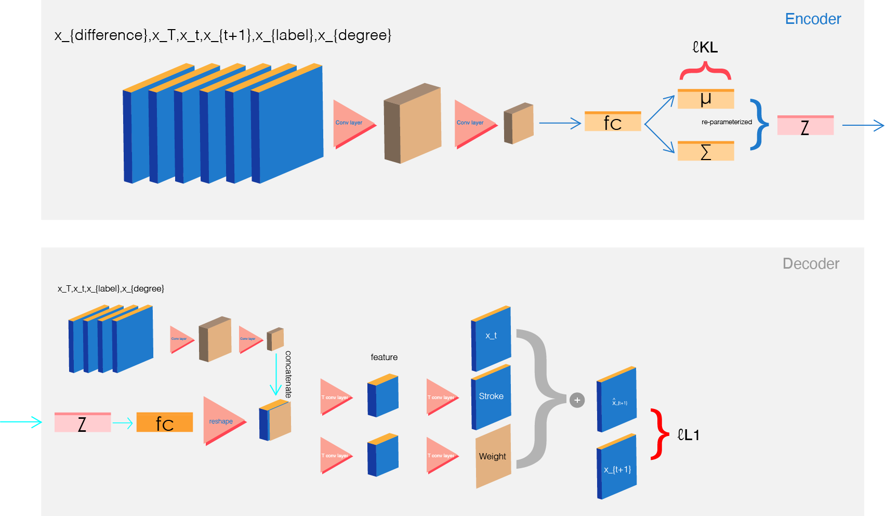
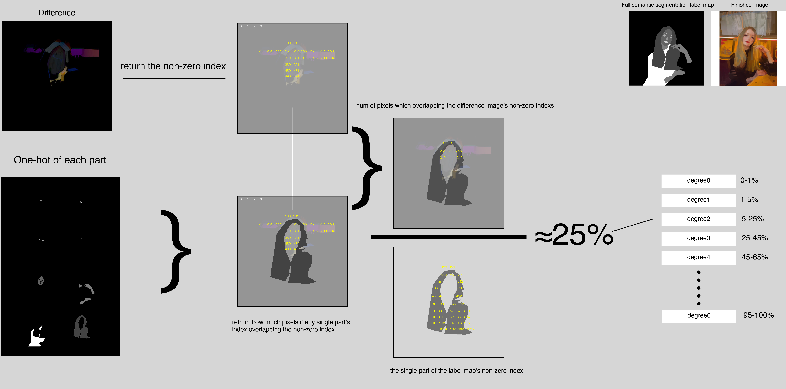
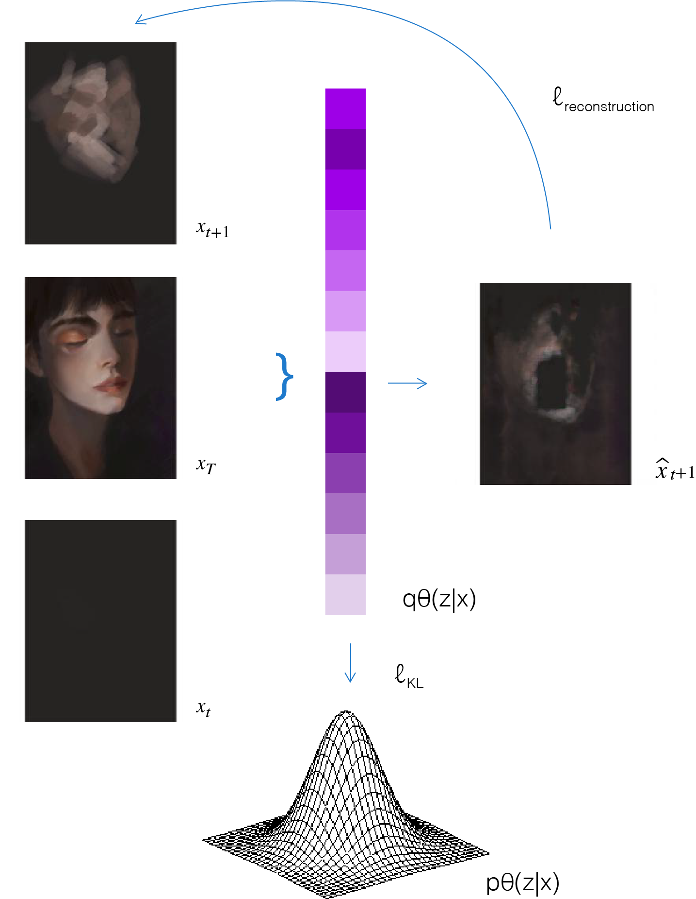
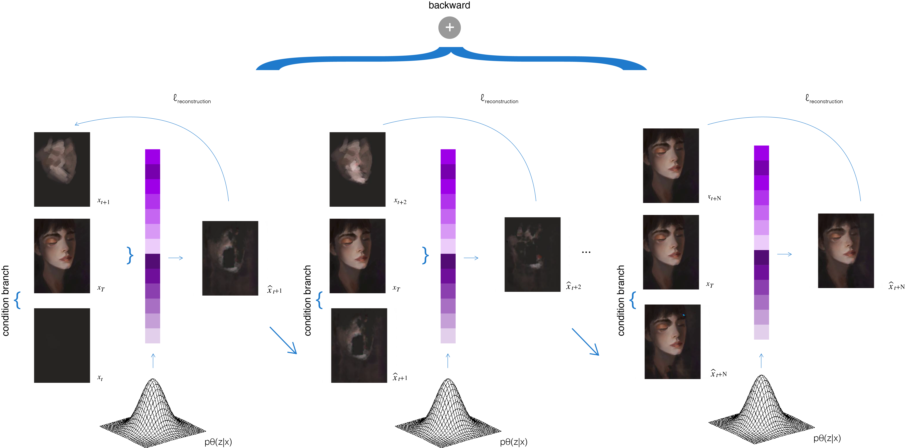

Outstanding painters and artists are sharing their drawing process on internet. There are thousands of painting styles and techniques when different artists create the same scene or object. Although creating one’s own art style and drawing habits is important, many new beginners start their career by imitating famous artists’ drawing approaches and techniques. However, what if those artists didn’t share any information about their painting or illustration techniques?  Would it be possible to use machine learning method to predict the inverse process, and reveal aspects of their potential technique from a single finished image? Given a certain finished image, how will another artist recreate this work? If we can train a model which can predict the problems mentions above, it will be helpful for those beginners who wants to learn the potential techniques and approaches they might take when attempting to construct an illustration and explore more potential possibilities of the whole process.
 
See our result below:
 

<iframe src="https://player.vimeo.com/video/484815033" style="position:absolute;top:0;left:0;width:100%;height:100%;" frameborder="0" allow="autoplay; fullscreen" allowfullscreen></iframe>

 

Our model used VAE + GAN structure. The target of our model is to capture the stroke changing between each stage and draw at the previous frames until it reach to the painting we gave.
See our code at : https://github.com/waihinchan/scar

Our model structure at below:

 

We used a auto labeling function to label our dataset.

 

To train our model, please  run our pair-wise optimization first, then run our sequence-wise optimization.

